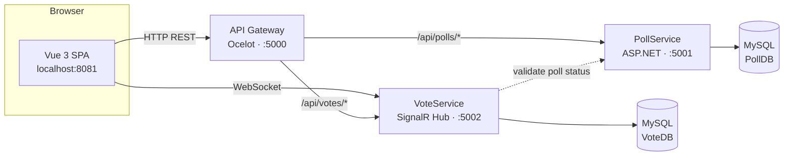

# Real-Time Poll & Survey System with Microservices

> A complete microservices application where users create polls with 4 question types,
> share via QR codes, and watch votes come in **live** using **SignalR WebSockets**.
> Built with **Vue 3**, **ASP.NET Core 8**, **MySQL**, **Ocelot Gateway**, and **Docker**.

**🌐 Live Demo:** [https://poll.vit.io.vn](https://poll.vit.io.vn)

**Estimated reading time:** 30 minutes · **Level:** Intermediate

---

## 📦 What's in this repository

| Resource | Path | Use it for |
|----------|------|-----------|
| 🖥️ Frontend (Vue 3) | [`client/`](client/) | User interface with real-time updates |
| 🔐 Poll Management Service | [`PollService/`](PollService/) | CRUD operations for polls |
| 🗳️ Vote & Real-Time Service | [`VoteService/`](VoteService/) | Vote submission + SignalR Hub |
| 🚪 API Gateway | [`OcelotGateway/`](OcelotGateway/) | Single entry point for all requests |
| 🐳 Docker setup | [`docker-compose.yml`](docker-compose.yml) | Multi-container orchestration |
| 🗄️ Database | MySQL 8.0 | Two databases: PollDB, VoteDB |

---

## 🔌 Ports used in this project

| Component | URL | Note |
|-----------|-----|------|
| **Frontend (production)** | http://localhost:8081 | nginx serves the built Vue app |
| **Frontend (dev server)** | http://localhost:8080 | `npm run serve` |
| **API Gateway (Ocelot)** | http://localhost:5000 | **the only URL the browser calls** |
| PollService | http://localhost:5001 | Swagger at `/swagger` (internal access) |
| VoteService | http://localhost:5002 | Swagger at `/swagger` + SignalR at `/hubs/vote` |
| MySQL (PollDB) | localhost:3306 | database for polls and options |
| MySQL (VoteDB) | localhost:3306 | database for votes |

> The browser → **gateway (5000)** → PollService (5001) / VoteService (5002). The 5001/5002
> ports are mainly for testing each service's Swagger directly. For WebSocket (SignalR),
> the client connects directly to VoteService :5002.

---

## ⚡ Quick start (just run it)

Want to see the finished app before diving into code? With **Docker Desktop running**:

```bash
docker-compose up --build
```

Wait ~2 minutes (first run), then open **http://localhost:8081**. Create a poll, share
the code, vote from another browser tab, and watch results update in real-time. That's
the whole stack — gateway + both APIs + Vue frontend + MySQL — in one command.

To understand *how* it works and *how to deploy*, follow the sections below.

---
## Table of contents

1. [What you will learn](#1-what-you-will-learn)
2. [Learning objectives](#2-learning-objectives)
3. [Prerequisites & tools](#3-prerequisites--tools)
4. [Architecture overview](#4-architecture-overview)
5. [Project structure](#5-project-structure)
6. [Part A — Setup MySQL databases](#6-part-a--setup-mysql-databases)
7. [Part B — The Poll Management service](#7-part-b--the-poll-management-service)
8. [Part C — The Vote & Real-Time service](#8-part-c--the-vote--real-time-service)
9. [Part D — The API Gateway (Ocelot)](#9-part-d--the-api-gateway-ocelot)
10. [Part E — The Vue frontend](#10-part-e--the-vue-frontend)
11. [Part F — SignalR real-time features](#11-part-f--signalr-real-time-features)
12. [Part G — Run the full stack locally](#12-part-g--run-the-full-stack-locally)
13. [Part H — Dockerize everything](#13-part-h--dockerize-everything)
14. [Part I — Deploy to production](#14-part-i--deploy-to-production)
15. [Testing & CI/CD](#15-testing--cicd)
16. [Testing checklist](#16-testing-checklist)
17. [Troubleshooting](#17-troubleshooting)
18. [Key concepts glossary](#18-key-concepts-glossary)

---

## 1. What you will learn

A **Real-Time Poll & Survey System** with these features:

- **Create Polls** — 4 question types: Multiple Choice, Yes/No, Star Rating (1-5), Open Text
- **Share Polls** — via 8-digit code or QR code
- **Anonymous Voting** — no login required, duplicate prevention with browser tokens
- **Live Updates** — see votes appear instantly using SignalR WebSockets
- **Admin Controls** — stop polls manually, delete them anytime
- **Analytics Dashboard** — visual charts with real-time updates

This is a **microservices** design: independent services (PollService, VoteService), each
with its own database, an API gateway as the single entry point, plus a Vue frontend.

---

## 2. Learning objectives

By the end of this guide you will understand:

- The **microservices** pattern with the **database-per-service** rule
- How an **API Gateway** (Ocelot) routes requests to backend services
- Building **REST APIs** in **ASP.NET Core 8** with **Entity Framework Core** and **MySQL**
- **Real-time communication** with **SignalR WebSockets**
- Building a **Vue 3 SPA** with real-time updates
- **Duplicate vote prevention** using browser fingerprints
- Orchestrating multiple containers with **docker-compose**
- Deploying a microservices app to **production**

---

## 3. Prerequisites & tools

Install these before you start:

| Tool | Version | Check with |
|------|---------|------------|
| [.NET SDK](https://dotnet.microsoft.com/download) | 8.0+ | `dotnet --version` |
| [Node.js](https://nodejs.org) | 16+ | `node --version` |
| [Docker Desktop](https://www.docker.com/products/docker-desktop/) | latest | `docker --version` |
| [Git](https://git-scm.com/) | latest | `git --version` |
| A code editor | — | VS Code / Visual Studio / Rider |

Optional but handy: **REST Client** or **Postman** to test APIs.

> 💡 **You don't need to install MySQL manually** — we run it as a Docker container.

---
## 4. Architecture overview

```
┌──────────────────────────────────────────────────────────┐
│                   Browser Client                          │
│         (Vue 3 + Tailwind + SignalR)                     │
└────────────────┬────────────────┬────────────────────────┘
                 │                │
        HTTP REST API        WebSocket (SignalR)
                 │                │
                 ▼                ▼
          ┌────────────────┐  ┌─────────────────┐
          │ Ocelot Gateway │  │  VoteService    │
          │   Port 5000    │  │   Port 5002     │
          └────────┬───────┘  └────────┬────────┘
                    │                  │
            ┌───────┴────────┐         │
            │                │         │
            ▼                ▼         │
    ┌─────────────┐   ┌──────────────┐ │
    │ PollService │◄──┤ VoteService  │◄┘
    │  Port 5001  │   │  Port 5002   │
    └──────┬──────┘   └──────┬───────┘
          │                 │
          ▼                 ▼
    ┌────────────┐    ┌─────────────┐
    │   PollDB   │    │   VoteDB    │
    │   (MySQL)  │    │   (MySQL)   │
    └────────────┘    └─────────────┘
```

<details>
<summary>Same diagram as Mermaid (renders on GitHub)</summary>


</details>

**How a request flows:**

1. The browser calls **the gateway** (`:5000`) for all HTTP requests (`/api/polls/*`, `/api/votes/*`).
2. The gateway (**Ocelot**) routes requests to PollService or VoteService, forwarding headers.
3. For **real-time updates**, the browser connects directly to VoteService's **SignalR Hub** (`:5002/hubs/vote`).
4. When a poll is created, **PollService** generates a unique 8-digit code and saves it to **PollDB**.
5. When a vote is submitted, **VoteService** validates the poll is active (via PollService),
   checks for duplicates (using `VoterToken`), saves to **VoteDB**, then broadcasts the update
   to all connected clients via SignalR.

> 🔑 **Key design decision:** Each service has its own database (database-per-service pattern).
> `PollCode` acts as the cross-database reference between PollDB and VoteDB.

---

## 5. Project structure

```
poll-survey/
├── README.md                     ← this guide
├── docker-compose.yml            ← runs the whole stack locally
├── .env.example                  ← environment variables template
│
├── PollService/                  ← Poll Management Microservice
│   ├── Controllers/
│   │   └── PollsController.cs    ← CRUD endpoints for polls
│   ├── Models/
│   │   ├── Poll.cs               ← Poll entity
│   │   └── Option.cs             ← Option entity (for Multiple Choice)
│   ├── Data/
│   │   └── PollDbContext.cs      ← EF Core database context
│   ├── Program.cs                ← Service startup configuration
│   ├── appsettings.json          ← Configuration (DB, CORS)
│   └── Dockerfile
│
├── VoteService/                  ← Vote & Real-Time Microservice
│   ├── Controllers/
│   │   └── VotesController.cs    ← Vote submission & analytics
│   ├── Hubs/
│   │   └── VoteHub.cs            ← SignalR WebSocket hub
│   ├── Models/
│   │   └── Vote.cs               ← Vote entity
│   ├── Data/
│   │   └── VoteDbContext.cs      ← EF Core database context
│   ├── Program.cs
│   ├── appsettings.json
│   └── Dockerfile
│
├── OcelotGateway/                ← API Gateway
│   ├── appsettings.json          ← Gateway routing configuration
│   ├── Program.cs
│   └── Dockerfile
│
└── client/                       ← Vue 3 Frontend
    ├── src/
    │   ├── views/
    │   │   ├── HomeView.vue      ← Landing page
    │   │   ├── CreatePollView.vue← Poll creation form
    │   │   ├── VoteView.vue      ← Voting interface
    │   │   └── AnalyticsView.vue ← Real-time results
    │   ├── api.js                ← HTTP client (calls gateway)
    │   ├── usePollHub.js         ← SignalR connection manager
    │   ├── voterToken.js         ← Browser fingerprint generator
    │   └── main.js
    ├── Dockerfile
    ├── nginx.conf                ← Production web server config
    └── package.json
```

> This repository contains all the code. You can **read along** to understand each part,
> then **run** it. If you prefer to build from scratch, the sections below explain how
> each piece was created.

---
## 6. Part A — Setup MySQL databases

We run MySQL 8.0 as a Docker container. For local development:

```bash
docker run -d \
  --name poll-mysql \
  -e MYSQL_ROOT_PASSWORD=root \
  -e MYSQL_DATABASE=PollDB \
  -p 3306:3306 \
  mysql:8.0
```

Verify it's running:

```bash
docker ps
```

You should see `poll-mysql` in the list. MySQL now listens on `localhost:3306`.

- **Username:** `root`
- **Password:** `root`

The databases (`PollDB`, `VoteDB`) will be created automatically by each service on first
startup via `db.Database.EnsureCreated()` (see each `Program.cs`).

> ⚠️ In the full stack (Part H) `docker-compose` starts MySQL **for you**, so you only
> need this manual step when running services directly with `dotnet run`. If you'll go
> straight to docker-compose, skip ahead to Part H.
>
> ⚠️ **Before moving to Part H**, remove this manual container to avoid port conflicts:
>
> ```bash
> docker rm -f poll-mysql
> ```

---

## 7. Part B — The Poll Management service

Location: [`PollService/`](PollService/).

### 7.1 What it does

- Creates polls with unique 8-digit codes
- Validates question types (1=Multiple Choice, 2=Yes/No, 3=Rating, 4=Open Text)
- Stores polls and options in **PollDB**
- Provides endpoints to get, update, and delete polls
- Notifies VoteService when a poll is closed

### 7.2 Key files

- **`Models/Poll.cs`** — Poll entity with Code, Question, QuestionType, Status
- **`Models/Option.cs`** — Option entity for Multiple Choice questions
- **`Data/PollDbContext.cs`** — EF Core context for PollDB
- **`Controllers/PollsController.cs`** — CRUD endpoints:
  - `GET /api/Polls/code/{code}` — retrieve poll by code
  - `GET /api/Polls/can-vote/{code}` — check if poll accepts votes
  - `POST /api/Polls` — create new poll
  - `PUT /api/Polls/code/{code}` — update poll (close it)
  - `DELETE /api/Polls/code/{code}` — delete poll and its votes
- **`Program.cs`** — configures EF Core, CORS, Swagger

### 7.3 Run and test it

```bash
cd PollService
dotnet restore
dotnet run --urls http://localhost:5001
```

Open Swagger at **http://localhost:5001/swagger** and try:

1. `POST /api/Polls` with:
   ```json
   {
     "question": "What's your favorite language?",
     "questionType": 1,
     "options": [
       { "text": "JavaScript" },
       { "text": "Python" },
       { "text": "C#" }
     ]
   }
   ```

2. You get back a poll object with a unique `code` (e.g., `"12345678"`). 🎉

**Expected response (201 Created):**

```json
{
  "poll": {
    "id": 1,
    "code": "12345678",
    "question": "What's your favorite language?",
    "questionType": 1,
    "status": 0,
    "options": [
      { "id": 1, "pollId": 1, "text": "JavaScript" },
      { "id": 2, "pollId": 1, "text": "Python" },
      { "id": 3, "pollId": 1, "text": "C#" }
    ]
  }
}
```

> ✅ **Checkpoint 1:** You can create a poll and retrieve it by code. The poll is stored
> in PollDB.

---

## 8. Part C — The Vote & Real-Time service

Location: [`VoteService/`](VoteService/).

### 8.1 What it does

- Accepts vote submissions with duplicate prevention
- Validates poll status by calling PollService
- Stores votes in **VoteDB**
- Broadcasts real-time updates via **SignalR**
- Provides analytics endpoint for vote results

### 8.2 Key files

- **`Models/Vote.cs`** — Vote entity with PollCode, OptionId, VoteValue, VoterToken
- **`Data/VoteDbContext.cs`** — EF Core context for VoteDB
- **`Hubs/VoteHub.cs`** — SignalR Hub for WebSocket connections
- **`Controllers/VotesController.cs`** — Vote endpoints:
  - `POST /api/Votes` — submit a vote
  - `GET /api/Votes/{pollCode}` — get vote summary
  - `DELETE /api/Votes?pollCode={code}` — delete all votes for a poll
  - `POST /api/Votes/broadcast-closed` — notify clients poll is closed
- **`Program.cs`** — configures EF Core, CORS, SignalR

### 8.3 Run and test it

Keep PollService running, and in a **second terminal**:

```bash
cd VoteService
dotnet restore
dotnet run --urls http://localhost:5002
```

Open **http://localhost:5002/swagger**:

1. Create a poll in PollService first (get a code)
2. Call `POST /api/Votes` with:
   ```json
   {
     "pollCode": "12345678",
     "optionId": 1,
     "voteValue": "",
     "voterToken": "browser-fingerprint-123"
   }
   ```

3. Call `GET /api/Votes/12345678` → **200 OK** with vote summary.

**Expected `GET /api/Votes/{pollCode}` response:**

```json
{
  "pollCode": "12345678",
  "total": 1,
  "summary": [
    { "optionId": 1, "voteValue": "", "count": 1 }
  ],
  "votes": [
    { "optionId": 1, "voteValue": "" }
  ]
}
```

> ✅ **Checkpoint 2:** You can submit a vote and retrieve vote data. Try submitting the
> same vote twice with the same `voterToken` — it should reject with "You have already voted."

---
## 9. Part D — The API Gateway (Ocelot)

Location: [`OcelotGateway/`](OcelotGateway/).

An **API Gateway** is the single entry point that routes requests to the right microservice.

### 9.1 Configuration

`appsettings.json` contains Ocelot routing rules:

```json
{
  "Routes": [
    {
      "DownstreamPathTemplate": "/api/polls/{everything}",
      "DownstreamScheme": "http",
      "DownstreamHostAndPorts": [{ "Host": "localhost", "Port": 5001 }],
      "UpstreamPathTemplate": "/api/polls/{everything}",
      "UpstreamHttpMethod": ["GET", "POST", "PUT", "DELETE"]
    },
    {
      "DownstreamPathTemplate": "/api/votes/{everything}",
      "DownstreamScheme": "http",
      "DownstreamHostAndPorts": [{ "Host": "localhost", "Port": 5002 }],
      "UpstreamPathTemplate": "/api/votes/{everything}",
      "UpstreamHttpMethod": ["GET", "POST", "PUT", "DELETE"]
    }
  ]
}
```

### 9.2 Run and test it

With PollService (5001) and VoteService (5002) running, start the gateway in a **third terminal**:

```bash
cd OcelotGateway
dotnet restore
dotnet run --urls http://localhost:5000
```

Now hit everything through **port 5000**:

```bash
curl http://localhost:5000/api/polls/code/12345678
curl -X POST http://localhost:5000/api/votes \
  -H "Content-Type: application/json" \
  -d '{"pollCode":"12345678","optionId":1,"voteValue":"","voterToken":"test-123"}'
```

> ✅ **Checkpoint 3:** All requests through :5000 work. The gateway is routing correctly.

---

## 10. Part E — The Vue frontend

Location: [`client/`](client/).

### 10.1 Key files

- **`src/api.js`** — HTTP client that calls the gateway at `http://localhost:5000`
- **`src/usePollHub.js`** — SignalR WebSocket connection manager
- **`src/voterToken.js`** — Generates unique browser fingerprint
- **`src/views/HomeView.vue`** — Landing page (join/create poll)
- **`src/views/CreatePollView.vue`** — Poll creation form
- **`src/views/VoteView.vue`** — Voting interface
- **`src/views/AnalyticsView.vue`** — Real-time results dashboard

### 10.2 Run the frontend

```bash
cd client
npm install
npm run serve
```

Open **http://localhost:8080**. Register, create a poll, and vote.

> ✅ **Checkpoint 4:** You can create polls, vote, and see results update live.

---

## 11. Part F — SignalR real-time features

### How it works

1. Client connects to `/hubs/vote` on VoteService
2. Client calls `JoinPollRoom(pollCode)`
3. Server adds client to group `poll_{pollCode}`
4. When someone votes, server broadcasts `VoteUpdated` to all clients in that group
5. Clients receive event and update UI instantly

### Events

**VoteUpdated** — New vote submitted:
```javascript
{
  pollCode: "12345678",
  totalVotes: 42,
  voteResults: [...]
}
```

**PollClosed** — Admin closed the poll:
```javascript
{
  pollCode: "12345678"
}
```

---

## 12. Part G — Run the full stack locally

To run **without Docker**, you need four terminals:

| Terminal | Command | URL |
|----------|---------|-----|
| MySQL | `docker run ... -p 3306:3306 mysql:8.0` | localhost:3306 |
| PollService | `dotnet run --urls http://localhost:5001` | http://localhost:5001/swagger |
| VoteService | `dotnet run --urls http://localhost:5002` | http://localhost:5002/swagger |
| Gateway | `dotnet run --urls http://localhost:5000` | http://localhost:5000 |
| Frontend | `npm run serve` | http://localhost:8080 |

---

## 13. Part H — Dockerize everything

From the repo root:

```bash
docker-compose up --build
```

This starts:
- MySQL (PollDB + VoteDB)
- PollService
- VoteService
- Gateway
- Frontend (nginx)

Open **http://localhost:8081** to see the production build.

Stop with `Ctrl+C`, then:

```bash
docker-compose down
```

---

## 14. Part I — Deploy to production

### Deployment to VPS

1. **Install Docker** on your VPS
2. **Clone repository** to VPS
3. **Create `.env` file** with your MySQL connection strings
4. **Run docker-compose**:
   ```bash
   docker-compose up -d
   ```

5. **Setup Nginx reverse proxy** for HTTPS
6. **Point domain** to your VPS IP

**Live demo:** [https://poll.vit.io.vn](https://poll.vit.io.vn)

---

## 15. Testing & CI/CD

This project includes **automated unit tests** and **GitHub Actions CI/CD pipeline**.

### 15.1 Unit Tests

We have **26 comprehensive unit tests**:

- **PollService.Tests** (12 tests) — Test poll creation, validation, retrieval, updates
- **VoteService.Tests** (14 tests) — Test vote submission, duplicate prevention, analytics

Run tests locally:

```bash
# All tests
dotnet test

# Specific service
dotnet test PollService/PollService.Tests/PollService.Tests.csproj
dotnet test VoteService/VoteService.Tests/VoteService.Tests.csproj
```

Expected output:
```
Test Run Successful.
Total tests: 26
Passed: 26
```

### 15.2 GitHub Actions CI/CD Pipeline

Located: `.github/workflows/ci-cd.yml`

**What it does:**
1. **Build & Test** — Compile code and run all unit tests
2. **Docker Build** — Build images for all services (Poll Service, Vote Service, Gateway, Client)
3. **Code Quality** — Run StyleCop analyzers
4. **Deploy** — Deploy to production (if main branch)

**How it triggers:**
- Automatically when you `git push`
- On pull requests to main/develop branches
- Tests must pass before deployment

**View results:**
1. Go to https://github.com/vitvu/poll-survey
2. Click **"Actions"** tab
3. View workflow runs and their status

### 15.3 Quick References

- 📖 **Detailed Guide:** See `CI-CD-GUIDE.md`
- ⚡ **Quick Start:** See `QUICK-START-TESTS.md`
- 📊 **Test Files:**
  - `PollService/PollService.Tests/PollsControllerTests.cs`
  - `VoteService/VoteService.Tests/VotesControllerTests.cs`

---

## 16. Testing checklist

### Poll Creation
- ✅ Create Multiple Choice poll
- ✅ Create Yes/No poll
- ✅ Create Star Rating poll
- ✅ Create Open Text poll
- ✅ Verify unique code generation
- ✅ Check QR code generation

### Voting
- ✅ Vote on all 4 question types
- ✅ Try voting twice (should be blocked)
- ✅ Vote from mobile device

### Real-Time Updates
- ✅ Open analytics on one device
- ✅ Vote from another device
- ✅ Verify instant updates

### Admin Functions
- ✅ Stop poll manually
- ✅ Delete poll
- ✅ Verify only creator can access analytics

---

## 17. Troubleshooting

### SignalR Connection Failed
- Check VoteService is running
- Verify CORS settings
- Check browser console for errors

### Database Connection Error
- Verify connection string in `.env`
- Check MySQL is running
- Test connection with MySQL client

### CORS Error
- Add frontend URL to `AllowedOrigins` in backend
- Restart services

---

## 18. Key concepts glossary

- **Microservices** — Independent services, each with its own database
- **API Gateway** — Single entry point that routes requests
- **SignalR** — WebSocket library for real-time communication
- **Entity Framework Core** — ORM for database access
- **JWT** — JSON Web Token for authentication (not used in this project)
- **Docker Compose** — Tool for multi-container applications

---

**🌐 Live Demo:** [https://poll.vit.io.vn](https://poll.vit.io.vn)
